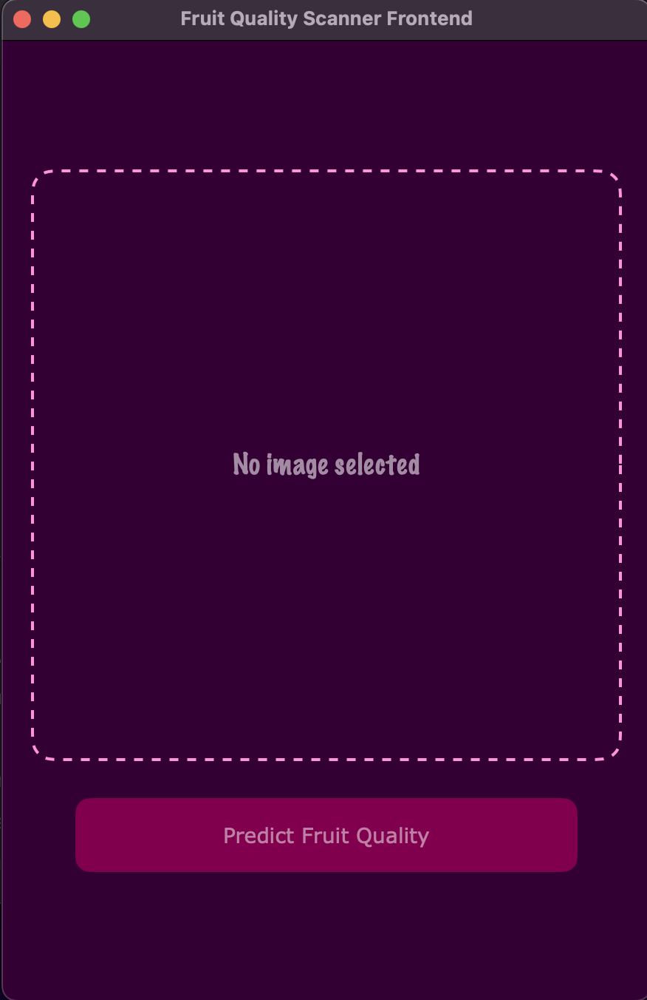
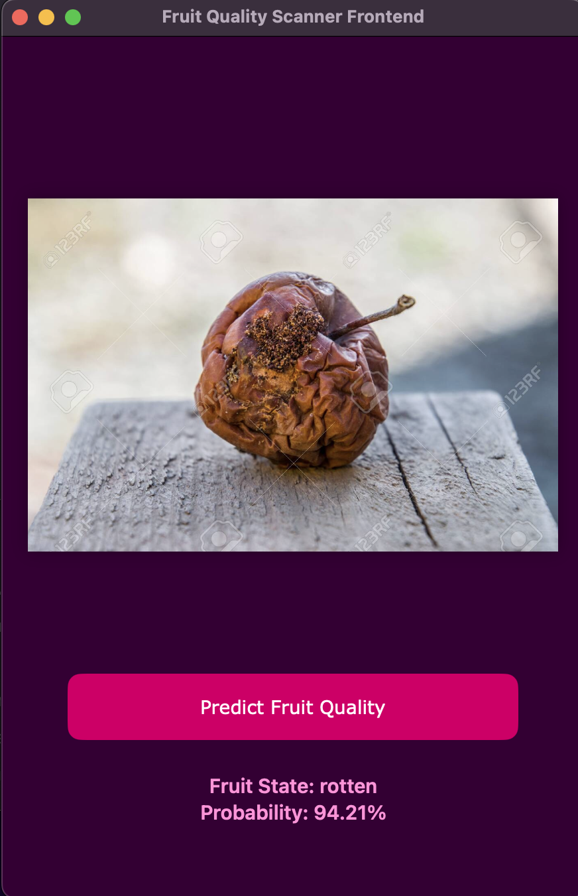

# 🍎 Fruit State Classifier App – Frontend

## 💡 Overview

This is the frontend of fruit state classifier app, which is written is Swift, specificly SwiftUI

## 🗒️ Features

* 🗛 Clear Design
* 📷 Usage of file picker with limited options to images

## ⚙️ Command Tools

To work with this project locally you need to build this application via XCode.

## 🧠 Tech Stack

  

 
